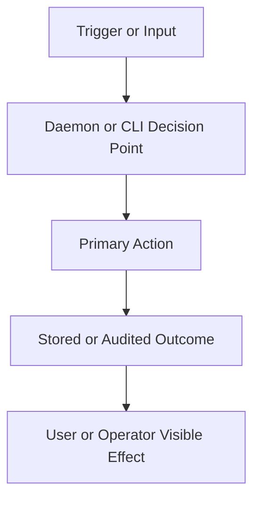

# RFD0000 - <Title>

- Feature Name: `<fill_me_in_with_a_unique_ident>`
- Start Date: `<YYYY-MM-DD>`
- Status: `<presented|accepted|rejected|implemented>`
- RFD PR: [leostera/gumgum#0000](https://github.com/leostera/gumgum/pull/0000)
- Gumgum Issue: [leostera/gumgum#0000](https://github.com/leostera/gumgum/issues/0000)

## Summary
[summary]: #summary

Write this so someone can decide whether to read the rest of the RFD.

Answer these questions in one short paragraph plus 3-5 bullets:

- What is being proposed?
- What kind of thing is it? For example: a CLI workflow change, daemon API contract, provider/runtime behavior, graph/state model change, install/setup policy, or snapshot of the current system.
- What are the 3-5 defining properties or constraints?
- What is explicitly out of scope?

This section should read like an abstract, not like an outline of the document.

Good summaries:

- lead with the proposal in one sentence
- group by big ideas and user/operator-visible properties
- say what kind of thing this is before talking about how it works
- compress many low-level constraints into 3-5 memorable traits
- leave detailed proof, invariants, and implementation mechanics for later

Avoid writing the summary as:

- a checklist of every architectural rule
- a mini changelog of all sections that follow
- a dense mechanism-first paragraph about internal data structures

Prefer a value-minded summary that explains why this matters before it dives into mechanism.

For snapshot RFDs, keep the same shape but describe the current system instead of a proposed change.

## Motivation
[motivation]: #motivation

Any change to gumgum should solve a real problem for people running apps, operating a gumgum server, or maintaining the control plane.

This section should explain that problem in detail, including the current baseline and why that baseline is not good enough.

The most useful way to write Motivation is usually:

1. state the current situation
2. name the concrete costs, frictions, or failure modes gumgum is paying today
3. explain why those costs are structural rather than incidental
4. show how the proposed change removes or reduces them

In other words, Motivation should be problem-first, not architecture-first.

Good motivation sections usually argue from operational pain:

- what is hard today
- what has to be reimplemented or worked around today
- what kinds of output, APIs, or workflows gumgum cannot provide from the current approach
- what kinds of maintenance or extension costs the current system imposes

Each point should ideally have the shape:

- today, gumgum pays cost `X`
- this proposal changes the system so gumgum gets `Y` instead

Avoid turning Motivation into:

- an early reference section
- an architecture preview about data structures or internal layering
- a description of what gumgum happens to have available technically, unless that fact is itself part of the problem statement

It should also contain several specific use cases where this change can help, and explain how it helps. This can then be used to guide the design of the feature.

This section is one of the most important sections of any RFD, and can be lengthy.

For snapshot RFDs, the only difference is that you don't need to specify the proposed changes, just state what costs gumgum is paying today.

## Guide-level explanation
[guide-level-explanation]: #guide-level-explanation

Explain the proposal as if it was already included in gumgum and you were teaching it to another gumgum contributor or operator.

The best guide-level sections usually start from a realistic gumgum workflow and show how it feels before they start naming internal concepts.

For example:

- "suppose we have this worker and want to deploy it to a server"
- "today gumgum has to do this awkward sequence of steps"
- "with this proposal, the flow becomes this instead"

The spirit of this section is:

- make the pain from Motivation visible in one or two realistic workflows
- show the user-facing, operator-facing, or contributor-facing flow before explaining internals
- teach the proposal through consequences first, architecture second

This does not need to be exact or exhaustive. It is a guide, not a reference. Rough flows, illustrative pseudo-code, and simplified examples are all fine if they teach the right mental model.

That means this section should usually do four things, roughly in this order:

1. walk through a concrete example or workflow
2. show the current friction or cost in that workflow
3. show how the proposed design changes the experience for the user, operator, or contributor
4. only then introduce the named concepts and internal mental model that make the example work

For infrastructure and implementation RFDs, a very strong pattern is:

1. "today, to do `X`, gumgum must do `A`, `B`, `C`"
2. "with this proposal, gumgum instead does `D`, `E`, `F`"
3. "here is the resulting API / command / workflow shape"
4. "here are the key consequences"

This section should make it obvious that the proposal changes the shape of the work, not just the internal implementation.

That generally means:

- introducing new named concepts
- explaining the feature largely in terms of examples
- explaining how gumgum users, operators, or contributors should think about the feature
- if applicable, providing sample CLI output, error messages, daemon API examples, config snippets, or migration guidance
- if applicable, describing the differences between teaching this to existing gumgum contributors and new users
- discussing how this impacts the ability to read, understand, and maintain gumgum code and operational state

Avoid starting Guide-level explanation with:

- a layering diagram
- a list of internal data structures
- a tour of implementation modules
- an architectural rule that has not yet been motivated by an example
- a walkthrough of semantic layers before the reader understands what practical problem those layers solve

For implementation-oriented RFDs, focus on how gumgum contributors should think about the change and give examples of its concrete impact. For product or policy RFDs, provide an example-driven introduction to the policy and explain its impact in concrete terms.

If the proposal has more than one important consumer, prefer showing at least two examples from different angles. For example:

- a project/worker workflow
- a server/operator workflow
- a daemon/API/provider workflow

That is often the fastest way to show that the proposal is one shared system rather than a narrow special-case integration.

For snapshot RFDs, explain the current system as if you were onboarding a contributor to it today.

### Diagram template (when relevant)

## Reference-level explanation
[reference-level-explanation]: #reference-level-explanation

This is the technical portion of the RFD. Explain the design in sufficient detail that:

- Its interaction with other gumgum subsystems is clear.
- It is reasonably clear how the feature would be implemented.
- Corner cases are dissected by example.

The section should return to the examples given in the previous section and explain more fully how the detailed proposal makes those examples work.

When relevant, cover:

- CLI command shapes and output
- daemon API contracts
- desired-state graph changes
- provider/runtime behavior
- config and persistence changes
- migration/backwards compatibility
- failure modes and rollback behavior
- dry-run/preview semantics

## Drawbacks
[drawbacks]: #drawbacks

Why should we *not* do this?

Consider operational complexity, UX tradeoffs, migration costs, compatibility breaks, safety risks, and implementation/maintenance burden.

## Rationale and alternatives
[rationale-and-alternatives]: #rationale-and-alternatives

- Why is this design the best in the space of possible designs?
- What other designs have been considered and what is the rationale for not choosing them?
- What is the impact of not doing this?
- Could this be done in a simpler gumgum module, library helper, CLI-only workflow, or daemon-only integration instead?

## Prior art
[prior-art]: #prior-art

Discuss prior art, both the good and the bad, in relation to this proposal.

A few examples of what this can include are:

- Similar features in self-hosted PaaS tools, cloud platforms, deployment systems, object stores, control planes, or CLIs.
- Prior approaches used inside gumgum itself.
- Practices from adjacent systems.
- Papers or posts that discuss related approaches.

This section is intended to encourage the author to think about lessons from other systems and provide readers with fuller context. If there is no prior art, that is fine.

Note that precedent in another system can be motivating, but does not on its own justify an RFD. gumgum may intentionally diverge from common patterns when it better fits gumgum's architecture, safety model, and product goals.

## Unresolved questions
[unresolved-questions]: #unresolved-questions

- What parts of the design do you expect to resolve through the RFD process before this gets merged?
- What parts of the design do you expect to resolve through implementation before rollout?
- What related issues are out of scope for this RFD that could be addressed in the future independently of this proposal?

## Future possibilities
[future-possibilities]: #future-possibilities

Think about the natural extension and evolution of your proposal and how it would affect gumgum holistically over time.

Use this section to consider future interactions with server setup, project/workspace configuration, provider lifecycle, graph convergence, daemon APIs, CLI UX, deployment, rollback, publishing, and operations.

This is also a good place to dump related ideas if they are out of scope for the RFD you are writing. If you have tried and cannot think of future possibilities, you may simply state that.

Note that having something written in this section is not by itself a reason to accept the current or a future RFD.
